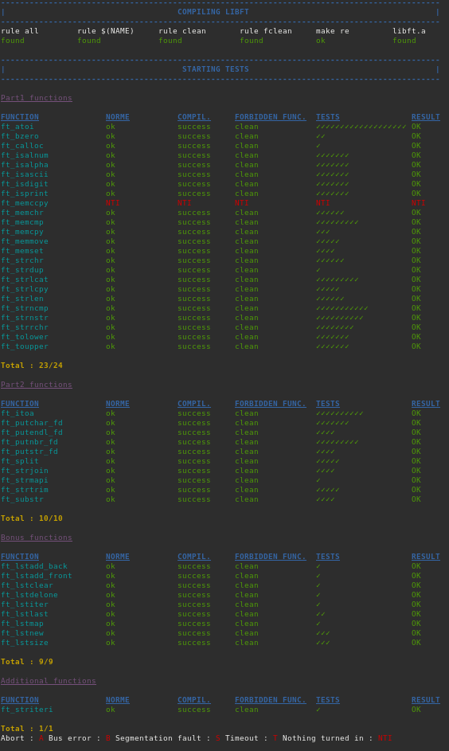
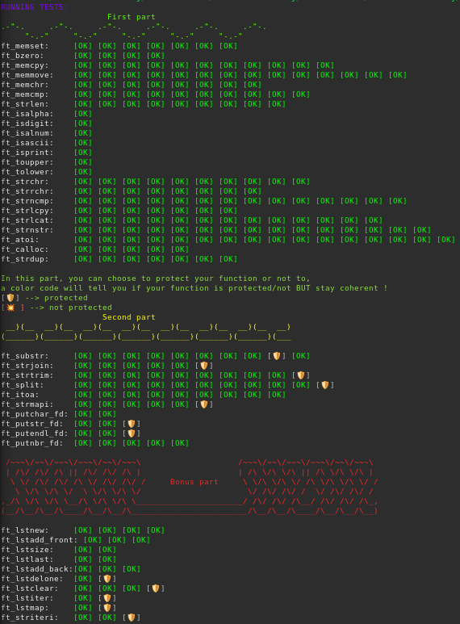
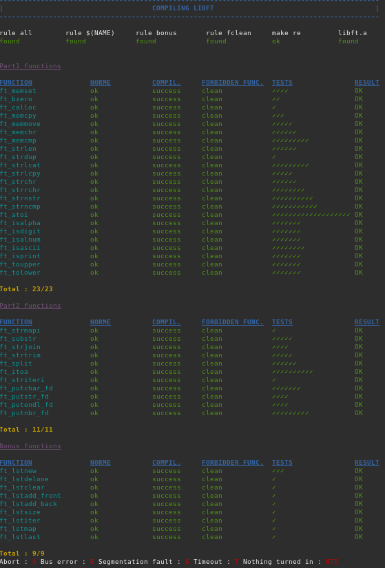

  <!-- Logo -->
  

  <!-- Project Name -->
  <h1>Libft Project</h1>

  <!-- Short Description -->
  
42 Porto Libft

 

  <!-- Badges -->
  

    
    
    
    
    
    
  

  <!-- Tree -->
<h4>
    <a href="https://github.com/knoxvillie/libft">:large_blue_diamond: View Demo</a>
   · 
    <a href="https://github.com/knoxvillie/libft">:beetle: Report Bug</a>
   · 
    <a href="https://github.com/knoxvillie/libft">:speech_balloon: Request Feature</a>
</h4>

  <!-- Subject -->
 
  <a href="subject.pdf"><strong>Explore the Subjetc »</strong></a>
 
 

  <h2>:star2: About The Project</h2>
  

    The main goal of this project is to build a library containing a variety of functions that will be used throughout the 42 Cursus. Most of the functions are low-level and work directly with memory management and allocation, key concepts of the C language. Learning about the building and implementation of the Makefile is the core of the project.
  

  <h2>:dart: Table of Contents</h2>

  
Mandatory Part One

  <ul>
  

    
ft_atoi.c

    
The ft_atoi() function converts the initial portion of the string pointed to by ptr to int representation. Not overflow protected.

    

  

    
ft_bzero.c

    
The ft_bzero() function writes n null bytes to the buffer. If n is zero, nothing is done.

    

  

    
ft_calloc.c

    
The ft_calloc() function contiguously allocates enough space for count objects that are size bytes of memory each. The allocated memory is filled with bytes of value zero.

    

  

    
ft_isalnum.c

    
The ft_isalnum() function tests for any character for which ft_isalpha or ft_isdigit is true.

    

  

    
ft_isascii.c

    
The ft_isascii() function tests for an ASCII character, which is any char between 0 and decimal 127(inclusive).

    

  

    
ft_isdigit.c

    
The ft_isdigit()function tests for a decimal digit character.

    

  

    
ft_isprint.c

    
The ft_isprint() function tests for any printing character including space (' ').

    

  

    
ft_memchr.c

    
The ft_memchr() function locates the first occurrence of a c in the string str.

    

  

    
ft_memcmp.c

    
The ft_memcmp() function compares byte string s1 against byte string s2.

    

  

    
ft_memcpy.c

    
The ft_memcpy() function copies n bytes from memory area src to memory area dest.

    

  

    
ft_memmove.c

    
The ft_memmove() function copies len bytes from string src to string dest.

    

  

    
ft_memset.c

    
The ft_memset() function writes n bytes of value c(converted to an unsigned char) to buffer.

    

  

    
ft_strchr.c

    
The ft_strchr() function locates the first occurrence of c(converted to a char) in the string pointed to by str.

    

  

    
ft_strdup.c

    
The ft_strdup() function allocates sufficient memory for a copy of the string str, does the copy, and returns a pointer to it.

    

  

    
ft_strdup.c

    
The ft_strdup() function allocates sufficient memory for a copy of the string str, does the copy, and returns a pointer to it.

    

  

    
ft_strlcat.c

    
The ft_strlcat() function concatenate strings with the same input parameters and output result as snprintf(3).

    

  

    
ft_strlcpy.c

    
The ft_strlcpy() function copies up to size - 1 characters from the NUL-terminated string src to dst, NUL-terminating the result.

    

  

    
ft_strlen.c

    
The ft_strlen() function computes the length of the string str.

    

  

    
ft_strncmp.c

    
The  ft_strncmp()  function  is similar, except it compares only the first (at most) n bytes of s1 and s2.

    

  

    
ft_strnstr.c

    
The ft_strnstr() function locates the first occurrence of the null-terminated string little in the string big.

    

  

    
ft_strrchr.c

    
The ft_strrchr() function is identical to ft_strchr(), except it locates the last occurrence of c.

    

  

    
ft_tolower.c

    
The tolower() function converts an upper-case letter to the corresponding lower-case letter.

    

  

    
ft_tolower.c

    
The toupper() function converts a lower-case letter to the corresponding upper-case letter.

    

  </ul>

  
Mandatory Part Two

  <ul>
  

    
ft_itoa.c

    
Allocates (with malloc(3)) and returns a string representing the integer received as an argument.Negative numbers must be handled.

    

  

    
ft_putchar_fd.c

    
Outputs the character 'c' to the given file descriptor.

    

  

    
ft_putendl_fd.c

    
Outputs the string 's' to the given file descriptor followed by a newline.

    

  

    
ft_putnbr_fd.c

    
Outputs the integer 'n' to the given file descriptor.

    

  

    
ft_putstr_fd.c

    
Outputs the string 's' to the given file descriptor.

    

  

    
ft_split.c

    
Allocates (with malloc(3)) and returns an array of string obtained by splitting 's' using the character 'c' as a delimiter. The array must end with a NULL pointer.

    

  

    
ft_striteri.c

    
Applies the function 'f' on each character of the string 's' passed as argument, passing its index as first argument. Each character is passed by address to 'f' to be modified if necessary.

    

  

    
ft_strjoin.c

    
Allocates (with malloc(3)) and returns a new string, which is the result of the concatenation of 's1' and 's2'.

    

  

    
ft_strmapi.c

    
Applies the function 'f' to each character of the string 's', and passing its index as first argument to create a new string (with malloc(3)) resulting from successive applications of 'f'.

    

  

    
ft_strtrim.c

    
Allocates (with malloc(3)) and returns a copy of 's1' with the characters specified in 'set' removed from the beginning and the end of the strin

    

  

    
ft_substr.c

    
Allocates (with malloc(3)) and returns a substring from the string 's' The substring begins at index 'start' and is of maximum size 'len'.

    

  </ul>

  
Bonus Part

  <ul>
  

    
ft_lstadd_back.c

    
Adds the node 'new' at the end of the list.

    

  

    
ft_lstadd_front.c

    
Adds the node 'new' at the beginning of the list.

    

  

    
ft_lstclear.c

    
Deletes the given node and every successor of that node, usign the function 'del'. Finally, the pointer to the list must be set to NULL.

    

  

    
ft_lstdelone.c

    
Takes as a parameter a node and frees the memory of the node's content usign the function 'del' given as a parameter and free the node.

    

  

    
ft_lstiter.c

    
Iterates the list 'lst' and applies the function 'f' on the content of each node.

    

  

    
ft_lstlast.c

    
Return the last node of the list.

    

  

    
ft_lstmap.c

    
Iterates the list 'lst' and applies the function 'f' on the content of each node.

    

  

    
ft_lstnew.c

    
Allocates (with malloc(3)) and returns a new node. The member variable 'content' is initialized with the value of the parameter 'content'.

    

  

    
ft_lstsize.c

    
Counts the number of nodes in a list.

    

  </ul>

 <!-- Contributing -->
<h2>:wave: Contributing</h2>

Special thanks to <a href="https://github.com/AlexMitcul" target="_blank"><strong>AlexMitcul</strong></a> for helping with the documentation.

 
Contributions are what make the open source community such an amazing place to learn, inspire, and create. Any contributions you make are **greatly appreciated**.

If you have a suggestion that would make this better, please fork the repo and create a pull request. You can also simply open an issue with the tag "enhancement".
Don't forget to give the project a star! Thanks again!

1. Fork the Project
2. Create your Feature Branch (`git checkout -b feature/AmazingFeature`)
3. Commit your Changes (`git commit -m 'Add some AmazingFeature'`)
4. Push to the Branch (`git push origin feature/AmazingFeature`)
5. Open a Pull Request

<h2 align="center">:wrench: Running Tests</h2>
<h4 align="center">
  <a href="https://github.com/alelievr/libft-unit-test" target="_blank">:paperclip: Libft-Unit-Test</a>
 · 
  <a href="https://github.com/knoxvillie/libft" target="_blank">:paperclip: Libft-War-Machine</a>
 · 
  <a href="https://github.com/knoxvillie/libft" target="_blank">:paperclip: Libftest</a>
 
 
</h4>
<h3 align="center">:camera: Screenshots</h3>

